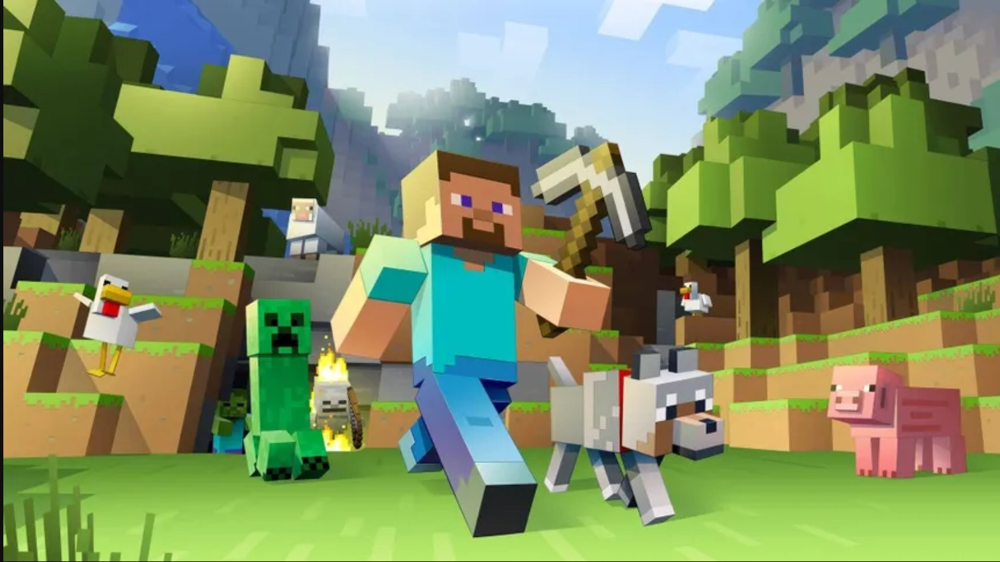
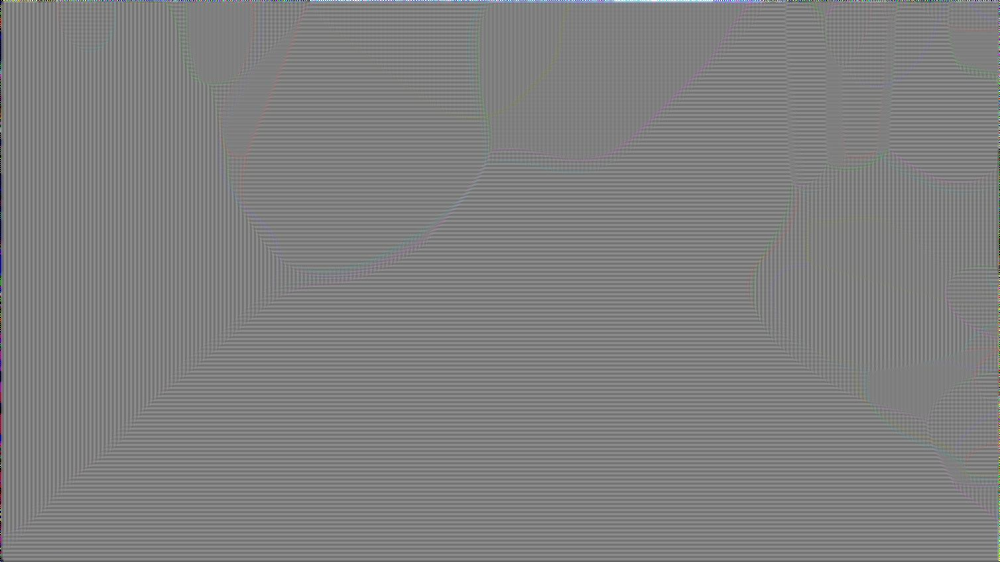

# Pattern Generators

This repository contains Python scripts for generating various types of patterns, including approximations of Turing patterns.

## Scripts

### 1. Turing Pattern Approximation (`turing_pattern.py`)

Generates Turing-like patterns by repeatedly applying blur and sharpen effects to an original image.

#### Requirements
- Python 3.x
- Pillow (PIL) library

Install Pillow with: `pip install pillow`

#### Usage
1. Place your original image as `original.jpg` in the same directory as the script.
2. Run the script: `python turing_pattern.py`
3. The resulting image will be saved as `turing_pattern.jpg`

#### How it works
The script loads the original image and applies the following operations 1000 times:
- Blur the image
- Sharpen the image using UnsharpMask filter

This iterative process can create interesting pattern-like effects reminiscent of Turing patterns, though it's a simplified approximation.

#### Note
Applying 1000 iterations on a large image may take some time and result in significant image degradation or noise amplification.

# Original Image

# Turing Image

### 2. Gray-Scott Model (`gray_scott.py`)

Simulates the Gray-Scott reaction-diffusion system to generate authentic Turing patterns like spots and stripes.

#### Requirements
- Python 3.x
- NumPy
- Pillow (PIL) library

Install dependencies with: `pip install numpy pillow`

#### Usage
1. Run the script: `python gray_scott.py`
2. The resulting pattern will be saved as `gray_scott.jpg`

#### How it works
The Gray-Scott model simulates two chemical species (u and v) that react and diffuse according to differential equations. This creates emergent patterns through self-organization.

Parameters are set for generating spot patterns. You can modify F, K, Du, Dv in the script for different patterns (e.g., stripes).

#### Note
The simulation runs for 10,000 steps on a 256x256 grid, which may take a minute or two depending on your hardware.
